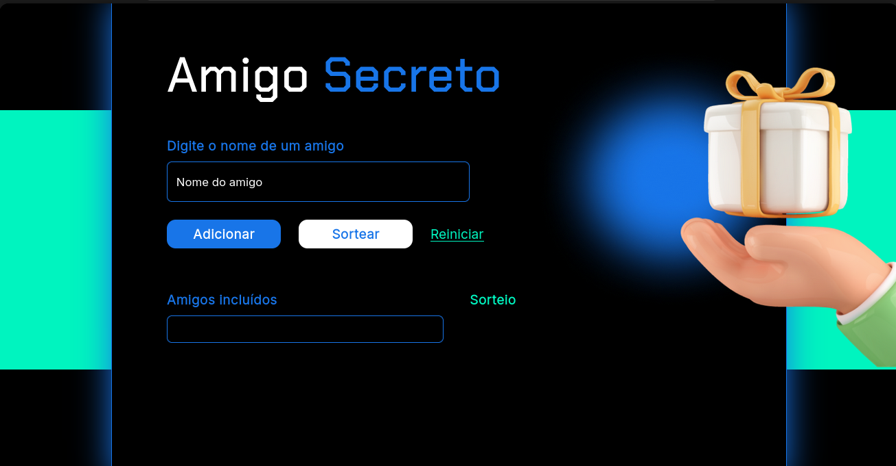
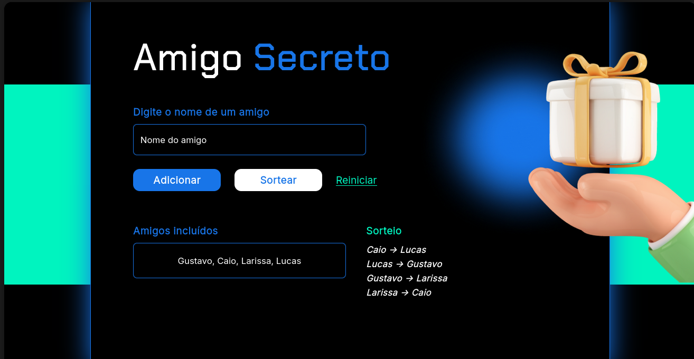

## Desafio de lógica de programação com JavaScript

Tecnologias utilizadas: 
* Javascript (ES6) 
* HTML5
* CSS3

O principal objetivo do desafio é criar um sorteio aleatório para brincar de amigo secreto.   
Aqui, podemos adicionar quais amigos partiparão do sorteio.

 
 

### Demonstração do projeto
Após a adição das pessoas, podemos clicar em sortear para saber quem tirou quem - esses valores serão mostrados na tela.

